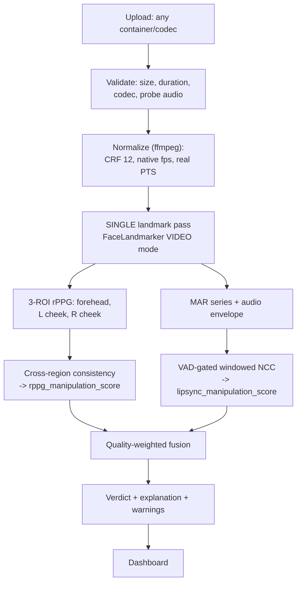

# Multi-Modal Deepfake & Manipulation Detection — 24-Hour Execution Plan (v2.1)

**Team size:** 4 · **Horizon:** 24 hours · **Delivery mode:** upload-only (no live capture)

**Thesis:** A manipulated face leaves traces in two independent physical channels — the *spatial consistency of blood flow across facial regions* and the *temporal alignment between speech and lip biomechanics*. Neither is what a generator optimizes for. We fuse both into one quality-weighted confidence score with a visible, explainable trail, and we abstain honestly when the evidence is weak.

---

## 0. Read This First

### 0.1 What changed from v1

| Area | v1 | v2 | Why |
|---|---|---|---|
| Demo mode | Live webcam centerpiece | Upload-only, curated corpus | Docker cannot reach the host webcam on Windows/macOS; live capture also conflicted with rPPG's stillness requirement |
| rPPG signal | "Is there a pulse?" | Cross-region pulse **consistency** | Face-swaps inherit blood flow from the driving video — pulse presence is not discriminative |
| Score meaning | Undefined (`rppg_score: 0.34` was ambiguous) | `*_manipulation_score`, always P(manipulated) | v1's own example payload contradicted itself |
| Fusion | Trained logistic regression | Quality-weighted score, **no training** | n≈28 clips with confounded compression cannot support a learned model |
| Verdicts | `REAL` / `FAKE` | `LIKELY_AUTHENTIC` / `LIKELY_MANIPULATED` / `UNCERTAIN` / `INSUFFICIENT_EVIDENCE` | Defensible under questioning; abstention is a feature |
| Landmarks | FaceMesh run twice (R1 + R2) | Single pass in preprocessing | Halves the dominant cost; stops modules disagreeing about the face |
| Checkpoints | "Directionally sensible" | Numeric gates | You cannot decide to cut scope against a vibe |
| Schedule | 24 productive hours, 4 people | Staggered 3h rest rotation + 15% unallocated | The v1 "15 min slack per block" was fictional; blocks summed to 100% of wall clock |
| Contracts | JSON examples | Pydantic models in shared module | Executable, mock-generating, validated by FastAPI for free |

### 0.1.1 What changed in v2.1 (self-audit of v2)

v2 was audited as if written by someone else. Twelve defects were found and fixed here — four of them blocking.

| Sev | Defect in v2 | Fix in v2.1 |
|---|---|---|
| **Blocker** | Role 2's T+0 go/no-go required a Wav2Lip clip that did not exist until T+7 — circular | Synthetic A/V desync proxy, buildable in one minute (§2 Role 2) |
| **Blocker** | Normalization command ended in `-an`, stripping the audio the pipeline needs; separate audio extraction silently injected stream-`start_time` offset into `median_lag_ms` | Audio command added + `av_start_offset_sec` tracked in the contract (§3.3, App. B) |
| **Blocker** | Phase 1's 0:30–2:00 block was double-booked — env setup alone consumed all 90 min | Phase 1 restructured; env setup runs concurrently with a designated fixer (§5) |
| **Blocker** | Generator model downloads + 1–3 h of fake-generation compute were unscheduled, yet gate CP2 | New H0-E; generation runs as a background job from T+2 (§1, §5) |
| High | `rppg_manipulation_score` scored noise as manipulation on dark/compressed authentic clips | Quality gate: below `rppg_quality` 0.30 the score is forced neutral (§3.4) |
| High | CP3 gated on `AUC ≥ 0.75` at n=10 — statistically a coin flip | AUC reported, not gated; CP3 gates on deterministic criteria (§4.3) |
| High | Subject-disjoint split impossible with 4 subjects; Class B leaked into Class A | Recruit extra faces; A/B pinned to the same split side; n stated (§4.1) |
| High | Fusion owner slept T+13–16 — bus factor 1 on the newest component | Rest pairs swapped; Role 3 named backup; tests required pre-sleep (§5) |
| High | `duration_sec ≤ 60` contradicted "analyze the first 20 s of a long clip" | Split into `source_duration_sec` / `analyzed_duration_sec` (§3.3) |
| High | ffmpeg scaled by width, not long edge — portrait phone clips exceeded the pixel budget | `force_original_aspect_ratio=decrease` (App. B) |
| High | No contingency if *neither* modality separates at CP2 | Explicit pivot branch (§4.3) |
| High | The 3-ROI mechanism was asserted without its cause, and without its caveat | Mask-boundary rationale + full-face-swap caveat stated (§3.4) |

### 0.2 Threat model — what "manipulated" means

State this on a slide. It is your strongest differentiator, because it shows you know *which* attack each modality catches.

| Attack class | Example tool | rPPG consistency catches it? | Lip-sync catches it? | In our corpus |
|---|---|---|---|---|
| **Face swap** — identity replaced, mouth motion is real | SimSwap, roop, FaceFusion | **Yes** — blend boundary breaks cross-region pulse phase | Weak — lips still match audio | Yes (Class C) |
| **Lip-sync / dubbing** — mouth redrawn to new audio | Wav2Lip | Weak — pulse largely intact | **Yes** — alignment drifts across windows | Yes (Class D) |
| **Face reenactment** — expression puppeteering | Face2Face-style | Partial | Partial | Best-effort (Class E) |
| **Fully synthetic video** | Text-to-video models | **Yes** — no coherent pulse at all | Varies | Best-effort (Class E) |
| **Voice clone only** (video authentic) | TTS / RVC | No | No — lips genuinely match the cloned audio | **Out of scope — declared** |
| **Presentation attack** (screen/print replay) | — | **Yes** | No | Out of scope for time |

The coverage matrix *is* the argument for fusion: no single modality covers rows 1 and 2 together.

### 0.3 Non-goals (locked — do not relitigate after Hour 1)

- Not training an rPPG neural network. Classical CHROM/POS only — documented, CPU-only, hours not days.
- Not beating published benchmarks. We demonstrate architecture and reasoning on a small, honestly-labeled demonstration corpus. We will say "demonstration corpus," never "benchmark."
- Not claiming universal robustness. Compression sensitivity, skin-tone bias, and corpus size are disclosed proactively.
- Not detecting audio-only deepfakes. Declared out of scope; named as roadmap item #1.
- Not shipping a learned fusion model unless the frozen-holdout gate at Hour 18 is already passed by the deterministic one.
- Not building live webcam capture. Upload-only.

### 0.4 Definition of Done

The project is done when a person who has never seen the repo can, on a machine with no internet:

```bash
docker compose up
```

…open `http://localhost:8501`, drag in any of the 28 corpus clips *or an arbitrary video of their own*, and within 10 seconds see a verdict, a confidence, two waveform plots, and a plain-English explanation — with no stack trace under any input.

---

## 1. Hour-0 Blockers (first 60 minutes, run in parallel)

These four things gate everything. Nothing else starts until each has a named owner and a written answer in the repo README.

| ID | Task | Owner | Output | Hard deadline |
|---|---|---|---|---|
| **H0-A** | Read the actual hackathon rules. Exact submission artifacts, demo time limit, whether pre-recorded video is permitted, deadline **in local time**, judging rubric weights. | Role 4 | `README.md#submission` | T+0:15 |
| **H0-B** | Hardware & environment inventory. Cores/RAM per laptop, GPU present, ffmpeg on PATH, Python version, Docker Desktop + WSL2 status. Nominate the **demo laptop** now. | Role 3 | `README.md#environment` | T+0:30 |
| **H0-C** | **Corpus acquisition — the #1 blocker.** Start all three tiers simultaneously; do not wait to see if Tier 1 lands. | Role 4 | `data/corpus/MANIFEST.csv` | Tier 3 by T+2:00 |
| **H0-D** | Lock contracts (§3). Write `contracts.py`, commit, everyone imports it. | Role 3 | `src/common/contracts.py` | T+1:00 |
| **H0-E** | **Download every model weight while venue Wi-Fi is uncongested.** MediaPipe `face_landmarker.task`, the face-swap tool's models, Wav2Lip checkpoints. All are multi-GB and all are needed offline later. | Role 2 | `models/` populated, checksums recorded | T+0:15 |

### H0-C corpus tiers (run all three in parallel)

**Tier 1 — Academic datasets (submit forms immediately, assume they will NOT arrive in time).**
FaceForensics++, Celeb-DF v2, DFDC Preview. All require signed EULAs or Kaggle rules acceptance with day-scale turnaround. Submit the forms in the first 10 minutes so that *if* they land you benefit — but build as though they will not. **Check redistribution terms before showing any frame publicly; most forbid it.**

**Tier 2 — Public circulating clips.** Well-known public deepfake demo reels. Usable for illustration; note provenance and license per clip in the manifest. Never commit the media to the repo.

**Tier 3 — Self-generated (this is your guaranteed path — treat it as a must-do, not a fallback).**
Each team member records 3 authentic clips (12–15s, speaking a fixed sentence, well-lit, frontal). Then generate manipulations of *your own faces* with an open tool:
- Face-swap class: SimSwap / FaceFusion, swapping teammates onto each other.
- Lip-sync class: Wav2Lip, driving your own face with different audio.

Tier 3 is strictly better than Tier 1 for a hackathon: **guaranteed availability, clean consent, zero license risk, and you control the attack type.** It also gives you the lip-sync class that public datasets underrepresent — the class your second modality exists to catch.

### Corpus composition target (~28 clips, 8–15s each)

| Class | Label | Count | Purpose |
|---|---|---|---|
| A | Authentic, clean | 6 | Baseline positives |
| B | Authentic, compressed (CRF 28 + 480p downscale of Class A) | 6 | **Compression-matched controls** |
| C | Face-swap | 6 | Primary attack |
| D | Lip-sync only (Wav2Lip) | 4 | Second attack; only modality 2 catches it |
| E | Fully synthetic / reenactment | 2 | Best-effort |
| F | Hard negatives — authentic but adverse: dark, side profile, no audio track, two faces in frame | 4 | Must produce `UNCERTAIN`, never `LIKELY_MANIPULATED` |

> **Class F is a smoke test, not coverage.** Four clips across four distinct adverse conditions is n=1 per condition. Report it that way; do not present it as evidence of robustness.

> **Generation compute is on the critical path.** Classes C and D are 10 generated clips. On CPU-only laptops, expect roughly 5–15 min per lip-sync clip and minutes per face-swap — call it **1–3 hours of wall-clock compute**, plus the H0-E weight downloads. Kick generation off as a **background job at T+2** and let it run while other work proceeds. If it has not finished by T+7, cut Class E first and reduce Class C to 4.

> **Class B is non-negotiable.** Public fake datasets ship heavily compressed (c23/c40). If your authentic clips are pristine and your fakes are compressed, any model — learned or hand-tuned — will discriminate **JPEG artifacts, not manipulation**, and you will demo a lie. Every fake must have a compression-matched authentic counterpart.

---

## 2. Team & Roles (rebalanced)

v1 loaded Role 2 with lip-sync + fusion + a stretch transformer + dataset collection, while Role 1 owned one module and Role 4 was labelled "blocks nothing" despite owning the actual deliverable. Corrected below.

### Role 1 — Biosignal Engineer (rPPG) — *also owns Fusion from T+9*

| | |
|---|---|
| **Owns** | Multi-ROI rPPG extraction → cross-region consistency features. From T+9, owns the fusion scorer. |
| **Deliverable** | `rppg.analyze(frames, landmarks, timestamps) -> RPPGResult`<br>`fusion.score(rppg, lipsync) -> FusionResult` |
| **Stack** | NumPy, `scipy.signal` (butter bandpass, Welch, hilbert), OpenCV |
| **Consumes** | `PreprocessResult` from Role 3 — includes landmarks and **real PTS timestamps** |
| **Blocks** | Fusion → API → dashboard |
| **T+0 task** | Implement CHROM on a synthetic sine-modulated video to prove the extractor recovers a known frequency **before** touching real faces. This is a 30-minute unit test that saves 4 hours of debugging. |

### Role 2 — Audio-Visual Engineer (lip-sync)

| | |
|---|---|
| **Owns** | Mouth-aspect-ratio time series, speech envelope, VAD-gated windowed alignment |
| **Deliverable** | `lipsync.analyze(landmarks, audio, timestamps) -> LipSyncResult` |
| **Stack** | `librosa` (log-mel, onset envelope), `scipy.signal.correlate`, `webrtcvad` or an energy-threshold VAD |
| **Consumes** | Same `PreprocessResult` — mouth landmarks come from Role 3's single pass, not a second FaceMesh |
| **Blocks** | Fusion |
| **T+0 task** | **Go/no-go for modality 2, using a synthetic desync proxy — no generated clips required.** Record 15s of yourself, then make a known-offset copy in one command:<br/>`ffmpeg -itsoffset 0.2 -i in.mp4 -i in.mp4 -map 1:v -map 0:a -c copy shifted.mp4`<br/>Plot z-scored MAR-derivative against the 1–8 Hz speech envelope for both. **If windowed cross-correlation cannot recover a known 200 ms shift by T+2, modality 2 is dead — escalate immediately.** A constant shift is the *easiest* case; Wav2Lip's wandering offset is strictly harder. |
| **Why a proxy** | v2 made this task depend on a Wav2Lip clip that does not exist until T+7 — the plan's most important early decision could not be made until it was too late to act on it. The proxy removes the dependency entirely and tests a strictly easier case first. |

### Role 3 — Pipeline & API Lead

| | |
|---|---|
| **Owns** | Ingestion, normalization, **the single landmark pass**, orchestration, API, error handling, Docker |
| **Deliverable** | FastAPI: `POST /upload`, `POST /analyze/{session_id}`, `GET /result/{session_id}`, `WS /progress/{session_id}` |
| **Stack** | FastAPI, Uvicorn, `ffmpeg-python`, MediaPipe FaceLandmarker (VIDEO mode), `ProcessPoolExecutor`, Docker Compose |
| **Blocks** | Everyone — hence mock-first |
| **T+0 task** | FastAPI skeleton returning hard-coded `FusionResult` from `contracts.py`. Unblocks Role 4 in 30 minutes. |
| **Critical responsibility** | Every upload is normalized *once*, landmarks extracted *once*, and CPU-bound work runs in a **process pool** — never on the event loop. |

### Role 4 — Corpus, Dashboard & Demo Owner

> **Correction to v1:** this role does not "block nothing." It owns the corpus that every checkpoint gate depends on, the dashboard that *is* the product, and the pitch. It is on the critical path from Hour 0.

| | |
|---|---|
| **Owns** | Corpus curation & manifest, Streamlit dashboard, explainability visuals, backup recording, deck |
| **Deliverable** | Dashboard (upload → waveforms + alignment overlay + gauge + explanation), `MANIFEST.csv`, backup video, 6-slide deck |
| **Stack** | **Streamlit** (locked at T+0:30, never revisited), Plotly. No `streamlit-webrtc` — upload-only removes that dependency entirely. |
| **Consumes** | Role 3's mock API from T+0:30 |
| **T+0 task** | Start Tier 1 EULA forms, then immediately begin Tier 3 self-recording. Corpus before UI. |

**Tie-break authority:** Role 3 is tech lead. When a checkpoint gate fails, Role 3 decides what gets cut, within 10 minutes, no debate.

---

## 3. Architecture & Executable Contracts

**Locked at T+1:00.** After that, contract changes require Role 3's approval and a broadcast message.

### 3.1 Pipeline



**The single landmark pass is the key structural fix.** In v1, Role 1 and Role 2 each ran FaceMesh — doubling the dominant cost (~6s of a 10s budget) and allowing the two modules to disagree about which face they were analyzing. One pass, one landmark array, both consumers read it.

### 3.2 Score polarity — the one rule that prevents the 3am bug

v1's §2.4 showed `final_verdict: "REAL"`, `confidence_score: 0.87`, `rppg_score: 0.34`, and an explanation claiming the pulse was clean. Is 0.34 "34% real" or "34% suspicious"? The spec never said, and its own example was internally inconsistent.

> **RULE:** Every score field is named `*_manipulation_score` and is **P(manipulated) ∈ [0,1]. Higher = more suspicious.** Every quality field is named `*_quality` and is **evidence strength ∈ [0,1]. Higher = more trustworthy.** No field is ever named just `score` or `confidence`.

Polarity is encoded in the field name so it cannot be misread at 3am.

### 3.3 Contracts (`src/common/contracts.py`)

Pydantic, not JSON examples. This gives you typed mocks, FastAPI response validation, and a test that fails the moment someone breaks the shape.

> **Pin `pydantic>=2` in `requirements.txt`.** `conlist(..., max_length=N)` below is v2 syntax; v1 spells it `max_items` and will fail in a confusing way.

```python
from enum import Enum
from typing import Literal
from pydantic import BaseModel, Field, conlist

SCHEMA_VERSION = "2.0"

class Verdict(str, Enum):
    LIKELY_AUTHENTIC     = "LIKELY_AUTHENTIC"
    LIKELY_MANIPULATED   = "LIKELY_MANIPULATED"
    UNCERTAIN            = "UNCERTAIN"
    INSUFFICIENT_EVIDENCE = "INSUFFICIENT_EVIDENCE"

class PreprocessResult(BaseModel):
    session_id: str
    schema_version: Literal["2.0"] = "2.0"
    video_path: str
    audio_path: str | None          # None == silent video, valid state
    av_start_offset_sec: float      # video.start_time − audio.start_time. MUST be
                                    # subtracted before lip-sync, or the muxer's own
                                    # offset lands in median_lag_ms. See Appendix B.
    nominal_fps: float              # metadata only — NEVER use this as a time axis
    frame_timestamps_sec: list[float]   # real PTS — the ONLY valid time axis
    source_duration_sec: float = Field(ge=4.0)                  # unbounded above
    analyzed_duration_sec: float = Field(ge=4.0, le=20.0)       # what we actually processed
    resolution: tuple[int, int]
    landmarks: list[list[tuple[float, float, float]] | None]  # None per undetected frame
    face_detection_rate: float = Field(ge=0, le=1)
    faces_detected_max: int
    warnings: list[str] = []

class RPPGResult(BaseModel):
    session_id: str
    heart_rate_bpm: float | None
    heart_rate_ci_bpm: tuple[float, float] | None   # see H5 — interval, not point
    rppg_manipulation_score: float = Field(ge=0, le=1)
    rppg_quality: float = Field(ge=0, le=1)
    band_snr_db: float
    cross_region_corr_min: float     # min pairwise Pearson across 3 ROIs
    cross_region_hr_spread_bpm: float
    phase_dispersion: float
    waveform_decimated: conlist(float, max_length=500)   # L2: transport-capped
    processing_time_ms: int
    degraded_reason: str | None = None

class LipSyncResult(BaseModel):
    session_id: str
    lipsync_manipulation_score: float = Field(ge=0, le=1)
    lipsync_quality: float = Field(ge=0, le=1)
    median_lag_ms: float | None
    lag_iqr_ms: float | None         # the real discriminator — see H7
    mean_peak_ncc: float | None
    speech_windows_used: int
    lag_resolution_ms: float         # honest quantization floor — see H6
    mar_decimated: conlist(float, max_length=500)
    envelope_decimated: conlist(float, max_length=500)
    processing_time_ms: int
    degraded_reason: str | None = None

class FusionResult(BaseModel):
    session_id: str
    schema_version: Literal["2.0"] = "2.0"
    verdict: Verdict
    manipulation_probability: float = Field(ge=0, le=1)
    evidence_weight: float = Field(ge=0, le=1)
    modality: dict[str, dict[str, float]]   # {"rppg": {"score":…, "quality":…, "weight":…}}
    explanation: str                        # generated FROM the decision path — see M5
    warnings: list[str] = []
    total_processing_time_ms: int
```

### 3.4 Metric definitions — no more "e.g. 0.4"

v1 referenced `signal_quality_score < 0.4` once and never defined how any score was computed. Three people would have built three scales. Definitions:

**`band_snr_db`** (de Haan-style pulse SNR). Given Welch PSD `P(f)` over the HR band 0.7–4.0 Hz and peak `f₀`:

```
signal_bins = bins within ±0.1 Hz of f₀  ∪  bins within ±0.2 Hz of 2f₀
band_snr_db = 10 · log10( Σ P[signal_bins] / Σ P[band \ signal_bins] )
```

**`rppg_quality`** = `clip((band_snr_db + 3) / 12, 0, 1)` — 0 at −3 dB, saturating at +9 dB.

**`rppg_manipulation_score`** — the C3 fix. **Not** "weak pulse ⇒ fake." It is cross-region *disagreement*, computed from three ROIs (forehead, left cheek, right cheek):

```
d1 = 1 − clip(cross_region_corr_min, 0, 1)          # signals should co-vary
d2 = clip(cross_region_hr_spread_bpm / 12, 0, 1)    # ROIs should agree on f₀
d3 = clip(phase_dispersion / (π/2), 0, 1)           # phases should be locked
rppg_manipulation_score = 0.4·d1 + 0.35·d2 + 0.25·d3
```

> **Mandatory quality gate (v2.1 fix).** Compute the above **only if `rppg_quality ≥ 0.30`**. Otherwise set `rppg_manipulation_score = 0.5` and `degraded_reason = "insufficient_pulse_snr"`.
>
> Without this gate, a dark or heavily compressed *authentic* clip has noise-dominated ROIs → low `cross_region_corr_min` → high `d1` → **it scores as manipulated**. Fusion's quality weight would rescue the verdict, but the score and the generated explanation would still accuse a real person. This is precisely the failure mode the cross-region design exists to avoid, and v2 reintroduced it one layer down.

**Why three ROIs, and why the forehead specifically.** Face-swap pipelines composite a generated face inside a mask that typically covers the central face and stops at or below the hairline. The forehead therefore usually sits **outside** the manipulated region while the cheeks sit **inside** it. Cross-region comparison works because it straddles that boundary — authentic skin on one side, synthesized skin on the other, and no generator optimizes for pulse phase agreement across a seam it cannot see.

**Caveat, and disclose it:** a full-face swap whose mask includes the forehead removes the contrast, and the signal degrades toward chance. Say so on the limitations slide rather than waiting to be asked.

A real face has correlated, phase-locked, frequency-agreed pulse across regions. A blended face-swap does not — the blend boundary cuts through the ROI set. **A weak-but-consistent signal yields low `quality` and a neutral score, not a "fake" verdict.**

**`lipsync_quality`** = `clip(speech_windows_used / 8, 0, 1)` — needs ≥8 voiced windows to be trusted at all.

**`lipsync_manipulation_score`**:

```
a = clip((lag_iqr_ms − 40) / 120, 0, 1)             # inconsistency across windows
b = 1 − clip(mean_peak_ncc / 0.4, 0, 1)             # weak alignment overall
c = clip((|median_lag_ms| − 60) / 200, 0, 1)        # large systematic offset
lipsync_manipulation_score = 0.5·a + 0.3·b + 0.2·c
```

`lag_iqr_ms` carries the most weight deliberately. A genuine recording can have a constant A/V offset from the encoder; what it does *not* have is an offset that **wanders window to window**. Wav2Lip output does.

### 3.5 Fusion — quality-weighted, deterministic, no training

This replaces v1's logistic regression (C5). With ~28 confounded clips, a learned model memorizes camera and compression. A hand-set quality-weighted mean is low-variance by construction, needs no training data, and *directly implements* v1's own graceful-degradation rule instead of bolting it on afterward.

```python
W = {"rppg": 0.5, "lipsync": 0.5}   # prior importance, hand-set

num = sum(W[m] * q[m] * s[m] for m in mods)
den = sum(W[m] * q[m] for m in mods)

evidence_weight = den / sum(W.values())
p = num / den if den > 1e-6 else 0.5
```

> **`evidence_weight` has a ceiling of 0.5 for single-modality cases.** A silent video with a flawless pulse reading maxes out at `0.5 × 0.9 / 1.0 = 0.45`. That clears today's 0.30 gate, but anyone who later raises `min_evidence_weight` above 0.5 silently breaks *every* silent clip. The ceiling is a property of the formula, not a bug — but it must be documented next to the threshold.

Decision policy — **single source of truth, `config/thresholds.yaml`, one file, no magic numbers in code:**

| Condition | Verdict |
|---|---|
| `evidence_weight < 0.30` | `INSUFFICIENT_EVIDENCE` |
| `p ≤ 0.35` | `LIKELY_AUTHENTIC` |
| `p ≥ 0.65` | `LIKELY_MANIPULATED` |
| otherwise | `UNCERTAIN` |

**Operating point rationale (say this if a judge asks):** the two error types are not symmetric. Labelling a real person's video as manipulated is defamatory; missing a fake is a miss. We therefore set a wide `UNCERTAIN` band and prefer abstention to a confident wrong answer. Abstention rate is a reported metric, not a hidden failure.

**Explanation generation (M5 fix):** the explanation string is generated *from the decision path* — which branch fired, which modality dominated `num`, which warnings triggered — never from a free-form template over raw numbers. A unit test asserts the explanation's directional claim matches `verdict` for all four verdicts. v1's example payload failed exactly this check.

---

## 4. Evaluation Protocol

v1 had no measurable criteria anywhere; "verdicts are directionally sensible" cannot tell on-track from broken at Hour 12, which is precisely when you must decide what to cut.

### 4.1 Splits

- **Dev set (~18 clips):** used for threshold calibration. Look at it freely.
- **Frozen holdout (~10 clips):** **subject-disjoint** from dev. Sealed at T+6.

**Two constraints v2 got wrong, and how to satisfy them:**

1. **You cannot split 4 subjects subject-disjointly and keep a meaningful holdout.** With Tier 3 as the primary source you have four faces; holding one out leaves a person-specific holdout of ~7 clips. **Fix at T+0:30: ask two or three neighbouring teams for a 15-second frontal clip each.** It takes five minutes, costs nothing, and takes you to 6–7 subjects — enough to hold out two people without collapsing the dev set. Whatever you end up with, state the subject count and clip count explicitly in `results/cp3.md`.
2. **Class B is a re-encode of Class A, so they share subjects.** Every A/B pair must land on the **same side** of the split, or the holdout leaks the dev set at a different bitrate. Assign the split by *subject*, then carry all of that subject's clips across every class with them.

**Holdout discipline.** Open it exactly twice. The **CP2 opening is diagnostic-only** — it tells you whether to keep going, and it contaminates everything after it, because you cannot unsee it. **The CP3 number is the reportable one, and it carries a footnote saying the holdout was inspected once at CP2.** Any threshold tuned after either opening invalidates the number, and you say so in the pitch. At n≈10 this is a sanity check, not an evaluation — present it as such.

### 4.2 Metrics

At n≈28, report honestly:
- Confusion matrix over {authentic, manipulated} × {authentic, manipulated, abstain}
- **Balanced accuracy** on non-abstained cases
- **AUC** with a bootstrap 95% CI (the CI will be wide — show it; that *is* the honesty)
- **Abstention rate**
- **Per-class recall**, especially Class D (lip-sync) — it validates the fusion argument
- **Class F must never produce `LIKELY_MANIPULATED`.** Any such case is a P0 bug.

### 4.3 Checkpoint gates — pass/fail, not vibes

| Gate | When | Criteria (ALL must pass) |
|---|---|---|
| **CP1** | T+6 | 1 real clip end-to-end through the real UI · no exception · all Pydantic contracts validate · latency measured and recorded (any value) · `main` tagged `cp1-green` |
| **CP2** | T+12 | ≥12 dev clips processed · balanced accuracy ≥ **0.70** on dev · zero unhandled exceptions · p95 latency ≤ **15s** · all four verdicts reachable **by unit test over synthetic inputs** (not corpus-dependent — the clips that trigger `INSUFFICIENT_EVIDENCE` may not exist yet) · holdout opened once, diagnostic-only |
| **CP3** | T+18 | Full corpus + 6 adversarial inputs (§6.2) · **zero** unhandled exceptions · **zero Class-F false alarms** · p95 latency ≤ **10s** · abstention rate between 5% and 35% · every §6.2 row has a passing test · **FEATURE FREEZE** |
| **CP4** | T+22 | Timed dry run completed twice · backup video recorded and uploaded · submission already filed |

> **Why CP3 no longer gates on AUC (v2.1 fix).** v2 required `AUC ≥ 0.75` on a 10-clip frozen holdout. At n=10 the bootstrap CI spans roughly 0.4–1.0, so that gate passes or fails close to at random — it could fail a working system at T+18, when there is no time to recover, or pass a broken one. §4.2 already conceded the CI would be wide; gating on it anyway was incoherent. **Accuracy and AUC are now measured and reported with their CIs; the gate is the deterministic set** — no crashes, no false alarms on authentic hard negatives, latency in budget. Those you can actually hold a build to.

If CP2 fails, Role 3 cuts scope within 10 minutes. Pre-agreed cut order: **stretch fusion → Class E clips → live progress WebSocket → dashboard polish.** Never cut: graceful degradation, the backup video, the honest-limitations slide.

**CP2 contingency — if *neither* modality separates.** The cut order above assumes at least one signal works. If both sit at chance on the dev set at T+12, do not spend Phase 3 chasing a detector that does not detect. **Pivot the framing, keep the code:** ship it as an *explainable liveness and media-integrity assessment* tool — it measures pulse recoverability, cross-region consistency, and audio-visual alignment, surfaces all three with waveforms, and abstains when the evidence is thin. Same pipeline, same dashboard, same honesty story, a claim you can actually defend. Judges reward a team that noticed its own null result over one that hid it behind a confident-looking number. Decide this at T+12, not at T+20.

### 4.4 Latency budget (12s clip @ 25 fps = 300 frames, CPU-only)

| Stage | Budget | Notes |
|---|---|---|
| Validate + probe | 0.3s | |
| ffmpeg normalize | 1.5s | CRF 12, no fps change |
| **Landmark pass (single)** | **6.0s** | Dominant cost. `FaceLandmarker` in **VIDEO mode** (uses inter-frame tracking) is materially cheaper than IMAGE mode, which re-detects every frame. ⚠️ `refine_landmarks` belongs to the **legacy `FaceMesh` solution**, not the `FaceLandmarker` Tasks API — confirm which API you are on at T+0:30 and use its actual options (`num_faces`, `min_*_confidence`). Do not discover this at T+3. |
| rPPG, 3 ROIs | 0.3s | Pure NumPy |
| Lip-sync | 0.4s | |
| Fusion + serialize | 0.1s | |
| **p95 total** | **≤ 10s** | Stretch: 6s |

v1 targeted 12–15s while running FaceMesh twice — the design could not meet its own budget. **Hour-9 performance lever if over budget:** split the clip in half across two processes in the pool. Landmarks are embarrassingly parallel; this roughly halves the dominant stage on any 4-core laptop.

---

## 5. Timeline

`T+0` = kickoff. **Rest is scheduled, not hoped for.** v1 planned 24 productive hours for 4 people with no sleep and no meals, and claimed "15 min slack in every block" while the blocks summed to 100% of wall clock.

**Rest rotation (3h each, pairs chosen so one backend + one frontend is always awake):**
- **Pair A — Role 2 + Role 4:** rest `T+13 → T+16`
- **Pair B — Role 1 + Role 3:** rest `T+16 → T+19`
- **Meals:** `T+4`, `T+10`, **`T+15`**, `T+20` — 30 min, staggered, never all four at once. *(v2 left a 10-hour gap straddling the fatigue trough.)*
- **Unallocated reserve:** `T+11:00–11:30`, `T+17:00–17:30`, `T+21:30–22:00`. This is real buffer. Do not schedule into it.

> **Rest pairs swapped in v2.1 (H4 fix).** v2 had Role 1 take over fusion at T+9 and then sleep T+13–16 — leaving the **newest and least-tested component with no owner awake** during the hardening window. Role 1 now rests in the *second* slot, after fusion has been through CP2 and a full triage pass.
>
> **Two hard preconditions before anyone sleeps:** (a) fusion unit tests are merged and green — the owner does not go off shift with untested code; (b) **Role 3 is the designated fusion backup** and has read the scorer. Bus factor of 1 on any component is a P1 to be fixed before the rotation starts.

> **Pitch speakers are assigned at T+18, not T+22.** Pair B rests T+16–19, so they are the freshest people in the room at the pitch slot. Name them at the CP3 gate so they can rehearse against the actual build rather than reading slides cold.

Phase 3 therefore runs at half staff by design. Its scope is sized accordingly.

---

### Phase 1 — Foundation (T+0 → T+6)

| Time | Role 1 | Role 2 | Role 3 | Role 4 |
|---|---|---|---|---|
> **Phase 1 was double-booked in v2 (B3 fix).** The 0:30–2:00 block gave four workstreams 90 minutes while the environment note separately budgeted 90 minutes for setup alone — leaving zero time for everything else in the block. Resolved by making setup **concurrent and owned**, not a task everyone stops to do.
>
> **The setup rule:** Role 3 is the **designated environment fixer** and owns `requirements.txt` (pinned versions, committed by T+0:45). Nobody else debugs an install. If your environment is broken, you **hand it to Role 3 and keep working on paper** — contracts, ROI polygon sketches, chart layouts, the corpus shot list. None of the T+0:30–2:00 work below requires a working environment for more than half its duration.

| Time | Role 1 | Role 2 | Role 3 | Role 4 |
|---|---|---|---|---|
| 0:00–0:30 | **Kickoff.** Confirm architecture, assign H0-A..E, create repo, agree git policy (§8.1). Start H0-E downloads *now* — they run in the background all morning. | | | |
| 0:30–2:00 | ROI polygon spec on paper → **CHROM on a synthetic sine** (recover a known 1.2 Hz signal before touching a real face) | **H0-E weight downloads**; synthetic-desync go/no-go (§2 Role 2) | **Env fixer** + repo scaffold + `contracts.py` + FastAPI returning mock `FusionResult` | H0-A rules; Tier 1 forms; **recruit 2–3 extra faces** (§4.1); begin Tier 3 self-recording |
| 2:00–4:00 | 3-ROI extraction + Welch HR + `band_snr_db` on 1 real clip | **Kick off Class C/D generation as a background job**; VAD gating + windowed NCC with parabolic peak interpolation | `/upload` → validate → ffmpeg normalize (both streams, §App B) → **single landmark pass** → process pool | Streamlit skeleton against mock API; upload widget; static gauge |
| 4:00–5:30 | Cross-region consistency features + the `rppg_quality` gate (§3.4); sanity-check HR against a phone/watch reading | Lag-IQR feature; first separation check on whatever generation has produced | Swap mocks for real modules behind a feature flag; WebSocket progress | Wire real API responses; corpus Classes A + B complete |
| 5:30–6:00 | **CP1 gate (§4.3).** All four present. Fix blockers only — no new features. Tag `cp1-green`. **Seal the frozen holdout — split by subject (§4.1).** | | | |

**Verification:** `pytest tests/test_contracts.py` green · one clip end-to-end recorded on video · latency logged · `requirements.txt` pinned and committed.

**Environment note (Windows):** ffmpeg must be on `PATH` outside WSL for the host path; Docker Desktop must be on the WSL2 backend. Pin exact versions in `requirements.txt` by T+0:45 — v1 budgeted 30 minutes to install MediaPipe, PyTorch, librosa, ffmpeg and Docker across four machines, which is not achievable (M6). Setup runs concurrently under Role 3 per the rule above; if any single machine is still broken at T+2, that person works against the mock API on the demo laptop rather than blocking.

---

### Phase 2 — Core Integration (T+6 → T+12)

| Time | Role 1 | Role 2 | Role 3 | Role 4 |
|---|---|---|---|---|
| 6:00–7:00 | Triage CP1. Re-plan if behind. Role 3 owns the cut decision. | | | |
| 7:00–9:00 | Detrending, motion-robust ROI via landmark-stabilized polygons, overlap-add windowing | Band-limit envelope to 1–8 Hz; tune window/hop; calibrate lag-IQR on dev | Per-module timeouts; degrade-to-`UNCERTAIN` path; structured JSON logging (M7) | Waveform + alignment overlay charts; corpus Classes C + D complete |
| 9:00–11:00 | **Takes over fusion** (H15 rebalance): implement quality-weighted scorer + `thresholds.yaml` + explanation generator | Handoff fusion inputs to Role 1; harden no-audio / no-speech paths | Input validation hardening; disk TTL; process-pool bounds | Confidence gauge; explanation rendering; Class E + F clips |
| 11:00–11:30 | **RESERVE — do not schedule** | | | |
| 11:30–12:00 | **CP2 gate (§4.3).** Run dev set + open holdout once. Record numbers in `results/cp2.md`. Tag `cp2-green`. | | | |

**Acceptance:** balanced accuracy ≥ 0.70 dev · zero exceptions · p95 ≤ 15s · all four verdicts reachable.
**Verification:** `python -m eval.run --split dev --out results/cp2.md`, committed.

---

### Phase 3 — Hardening & Edge Cases (T+12 → T+18, half staff)

| Time | Awake | Work |
|---|---|---|
| 12:00–13:00 | All | Triage CP2 by **demo-day risk**, not by interest. Assign P0/P1. |
| 13:00–16:00 | **Role 1 + Role 3** | **Arbitrary-input hardening (§6.2)** — the new top risk under upload-only. Portrait HEVC, 4K, 3-minute, silent, no-face, two-face, 0-byte, corrupted-header, `.exe` renamed `.mp4`. Every one returns a clean typed response, and every row of §6.2 gets a test. Role 1 (fusion owner, awake this slot): compression sweep (CRF 18/28/35) — confirm `rppg_quality` degrades smoothly, the §3.4 gate fires, and the verdict shifts to `UNCERTAIN`, **never** to `LIKELY_MANIPULATED`. |
| 16:00–17:00 | **Role 2 + Role 4** | Role 2: threshold calibration on dev only; fairness spot-check across available skin tones and lighting — **for pitch honesty, not to claim the bias is solved.** Role 4: cache 3 known-good demo results for instant replay; projector-readability pass; **name the pitch speakers (§5).** |
| 17:00–17:30 | — | **RESERVE** |
| 17:30–18:00 | All | **CP3 gate (§4.3).** Full 28 clips + 6 adversarial inputs, back to back. **FEATURE FREEZE.** Tag `cp3-demo-candidate` — *the demo runs from this tag, not from `main`.* |

> **Stretch fusion (2-layer transformer): the gate moves to T+14, not T+15–17.** v1 scheduled it to land one hour before freeze, trained on data only collected from T+7. At T+14, if the deterministic scorer has not already cleared CP2 comfortably, **drop it permanently** and say so. A working simple model beats a broken fancy one — v1 said this in §0 and then scheduled against it.

---

### Phase 4 — Polish & Pitch (T+18 → T+24)

| Time | Activity |
|---|---|
| 18:00–19:00 | Adversarial bug bash — each person tries to break someone else's flow. Fix P0 only. |
| 19:00–20:00 | **Record the backup demo.** Full screen capture of a successful run over 4 clips (authentic / face-swap / lip-sync / hard-negative-abstain). Insurance, not optional. |
| 20:00–20:30 | **SUBMIT A WORKING VERSION NOW** (M2). Portal outages and slow video uploads are routine; submitting in the final hour is a classic self-inflicted failure. Re-submit improvements later if any. Meal. |
| 20:30–21:30 | UI polish: strip debug output, loading states, projector-resolution check, no raw errors anywhere. |
| 21:30–22:00 | **RESERVE** |
| 22:00–23:00 | Build/finish deck (§7). Assign speaking order. **CP4:** two full timed dry runs with the backup cued. Rehearse Q&A. |
| 23:00–24:00 | Code freeze. Final re-submission if warranted. Verify offline: `docker run --network none`. Breathe. |

---

## 6. Risk Mitigation & Edge Cases

### 6.1 Risk matrix

| Risk | Likelihood | Impact | Mitigation | Fallback |
|---|---|---|---|---|
| **Corpus never materializes** (EULAs don't land) | **High** | **Critical** | Tier 3 self-generated fakes started at T+0, treated as the primary path, not a fallback | Face-swap + Wav2Lip on teammates' own faces — guaranteed available, clean consent |
| **Compression confound**: model learns codec artifacts, not manipulation | **High** | **Critical** | Class B compression-matched authentic controls are mandatory; every fake has a CRF-matched real counterpart | Report per-class results separately so the confound is visible if present |
| **rPPG survives face-swap**, breaking the thesis | High | Critical | Score cross-region *inconsistency*, not signal strength (§3.4) | Fusion down-weights rPPG via `quality`; lip-sync carries Class D regardless |
| **VFR→CFR transcode fabricates periodicity** | Med | **Critical** | Never resample frames. Keep native fps, extract real PTS, resample the *signal* on the true time axis | If PTS extraction fails → `INSUFFICIENT_EVIDENCE`, never a guessed uniform grid |
| **A judge uploads their own video and it fails** | **High** | **High** | §6.2 hardening + §6.4 protocol | Every failure is a typed, plain-English response; abstention is framed as designed behaviour |
| Event loop blocked by CPU-bound ML; progress bar freezes | High | High | `ProcessPoolExecutor`, one FaceLandmarker per worker, bounded queue | Progress falls back to a determinate stage counter |
| Latency over budget on demo laptop | Med | High | Single landmark pass; VIDEO mode; parallel half-clip split at T+9 | Cached results for the 3 curated demo clips replay instantly |
| MediaPipe downloads model weights on first run → needs internet | Med | High | Vendor `face_landmarker.task` into the image at build time | CI check: `docker run --network none` must pass before CP3 |
| Merge conflicts around T+10 | High | Med | Trunk-based, directory-per-role, Role 3 integrates (§8.1) | Revert to last `*-green` tag |
| Team exhaustion in hours 14–20 | **High** | High | Scheduled 3h rest rotation; low-cognitive-load tasks assigned to the trough | Half-staff Phase 3 scope is pre-sized for it |
| Judges ask about skin-tone bias | Med | Med (reputational) | Disclose proactively in the deck (§7.6) | "rPPG accuracy varies by skin tone due to melanin absorption in the green channel. It's a documented limitation, it's why we fuse a second independent modality rather than relying on it alone, and it's roadmap item #2. Our corpus is too small to quantify it, and we won't pretend otherwise." |
| Corpus licence forbids public display of frames | Med | Med | Check terms at H0-C before any clip enters the deck | Tier 3 self-generated clips carry no such restriction — default to them for the deck |
| Fusion produces `UNCERTAIN` on everything | Low | High | CP2 gate requires all four verdicts reachable | Widen thresholds in `thresholds.yaml` — one file, no code change |

### 6.2 Input edge cases — every one returns a typed response, never a stack trace

This is now a **demo requirement**, not Phase-3 polish, because upload-only invites arbitrary input.

| Input | Detection | Response |
|---|---|---|
| No face in any frame | `face_detection_rate < 0.1` | `INSUFFICIENT_EVIDENCE` — "No face detected. Try a clip with a clearly visible frontal face." |
| Face in <60% of frames | `face_detection_rate < 0.6` | Analyze detected span; warn "Face visible in only 42% of frames — confidence reduced." |
| Multiple faces | `faces_detected_max > 1` | Track the largest, most-centred face. Warn explicitly: "2 faces detected; analyzing the largest." |
| Side profile / extreme yaw | Landmark z-spread heuristic | `rppg_quality → 0`, lip-sync continues if mouth visible |
| **No audio track** | `probe` finds no audio stream | `audio_path = None`, lip-sync returns `quality=0`, fusion runs on rPPG alone with reduced `evidence_weight`. **Not an error.** |
| Audio present but no speech | `speech_windows_used < 8` | Same as above, warn "No speech detected." |
| Clip < 4s | Duration check | Reject at upload: "Minimum 4 seconds — rPPG needs a window to resolve heart rate." |
| Clip > 20s | Duration check | Accept any length; record `source_duration_sec`, analyze the **first 20s**, set `analyzed_duration_sec`, warn the user. Never process 3 minutes live. *(v2 capped `duration_sec` at 60 in the contract while promising to accept longer clips here — a 3-minute upload would have 500'd on validation.)* |
| 4K / very large | Resolution check | Downscale to 640px **long edge** (`force_original_aspect_ratio=decrease`, App. B) |
| Portrait / rotated | ffmpeg rotation metadata | Apply `autorotate`; landmarks fail silently on un-rotated video otherwise |
| Exotic codec (HEVC, AV1, ProRes) | `ffprobe` | ffmpeg handles it; if the decode fails → typed error naming the codec |
| Corrupted / truncated file | ffprobe non-zero exit | "File could not be read as video." No traceback. |
| 0-byte or non-video renamed `.mp4` | Magic-byte + ffprobe | Reject at upload |
| > 100 MB | Size cap | Reject before touching disk |

**Every row above has a test in `tests/test_edge_cases.py`. CP3 will not pass with any row untested.**

### 6.3 Signal-level edge cases

- **The OpenCV timing trap — this one will bite you silently.** §6.1 rates fabricated periodicity as Critical and mandates real PTS, but the way you *actually* reintroduce it is `cv2.CAP_PROP_FPS`. On a variable-frame-rate file OpenCV reports a single nominal figure, and indexing frames as `i / fps` rebuilds exactly the uniform grid the plan forbids — with no error and a plausible-looking waveform. **Rule: `nominal_fps` is metadata for display only. The ffprobe PTS array is the only time axis, and every resample interpolates onto it.** Add an assertion that the PTS array length equals the decoded frame count; if they disagree, degrade to `INSUFFICIENT_EVIDENCE` rather than guessing.
- **A/V stream offset.** MP4 containers routinely give the video and audio streams different `start_time` values. Extracting audio in a separate pass and assuming both start at zero puts the muxer's offset straight into `median_lag_ms` — you would be measuring the container, not the speaker. Read both `start_time`s, store the delta as `av_start_offset_sec`, and subtract it before any lip-sync computation. See Appendix B.
- **Lighting flicker.** Mains-frequency lighting can alias into the 0.7–4 Hz HR band depending on the source frame rate. Detect a spectral peak with abnormally high Q and flag `warnings: ["possible_illumination_artifact"]`, reducing `rppg_quality`. (Under upload-only you cannot control capture conditions — so you *detect and report* rather than prevent.)
- **HR precision.** An 8s window at 25 fps gives roughly 7–15 bpm frequency resolution depending on Welch segmentation. v1's `heart_rate_bpm: 78.4` implied 0.1 bpm precision that does not exist. Require **≥12s**, zero-pad the FFT to 4096 for peak interpolation, and report `heart_rate_ci_bpm` as an interval. The UI shows "≈78 bpm (68–88)".
- **Lag quantization.** At 25 fps, one frame is 40 ms — so v1's `sync_offset_ms: 40` was exactly the quantization floor reported as a measurement. Use parabolic sub-sample interpolation around the NCC peak and always surface `lag_resolution_ms` alongside the estimate.
- **Cross-correlation bias.** Raw `numpy.correlate` on unnormalized envelopes is dominated by DC energy and carries a triangular length bias toward zero lag. Z-score both series and use `scipy.signal.correlate(..., method='fft')` with explicit length normalization.
- **Bilabial confound.** /m/, /b/, /p/ are high-energy *and* mouth-closed, so raw MAR-vs-RMS anti-correlates during those phonemes. Correlate the **MAR derivative magnitude** against the 1–8 Hz syllabic envelope rather than MAR against raw RMS.
- **Transcoding does not restore lost signal.** v1 twice described ffmpeg transcoding as "the compression-robustness fix." It is not — re-encoding cannot recover a destroyed micro-signal and default CRF damages it further. Transcoding is *normalization*. Use CRF ≤ 12 to avoid adding damage, and treat true compression robustness as a measured, disclosed limitation.

### 6.4 The "can I upload my own video?" protocol

Assume a judge asks. Say yes — this is a strength if rehearsed.

1. **Accept it.** Refusing looks like you're hiding cherry-picking.
2. Expect it to be a phone clip: portrait, VFR, HEVC, possibly no clear frontal face. §6.2 covers all of these.
3. If the result is `UNCERTAIN` or `INSUFFICIENT_EVIDENCE`, **that is the correct answer and you say so confidently**: *"That's the system working. Handheld phone video at that compression level doesn't carry a recoverable pulse signal, so we abstain rather than guess. A detector that always answers is a detector that's lying about a third of the time."*
4. Have this line rehearsed. It converts your highest-risk moment into your credibility moment.

---

## 7. Demo & Pitch Strategy (upload-only)

**~4–5 minutes.** Upload-only makes this *lower risk and more compelling* than v1's live-webcam plan, because you can walk the coverage matrix live instead of proving one instance.

1. **Hook (30s).** Pixels can be faked convincingly. But a face has to keep a *consistent* pulse across every region of skin at once, and lips have to stay locked to speech across every syllable. Generators optimize for neither.
2. **Clip 1 — authentic (45s).** Upload a Class A clip. Verdict `LIKELY_AUTHENTIC`. Point at the three ROI waveforms moving in phase.
3. **Clip 2 — face-swap (45s).** Verdict flips to `LIKELY_MANIPULATED`. **Show that the pulse is still present** — then show the cross-region phase dispersion spike. This is the moment that separates you from every other rPPG demo in the room: *"the naive version of this idea looks for a missing pulse. Face-swaps keep the pulse — they inherit it from the driving video. What they can't keep is agreement between regions."*
4. **Clip 3 — lip-sync deepfake (30s).** rPPG says authentic. Lip-sync catches it. **This slide justifies the entire fusion architecture** — one modality would have missed it.
5. **Clip 4 — hard negative (20s).** A genuine but dark/compressed clip. Verdict `UNCERTAIN`. *"We abstain. Deliberately."*
6. **Architecture in one diagram (30s).** Reuse §3.1. Input → two independent physical signals → quality-weighted fusion → verdict, traceable in one glance.
7. **Honest limitations (30s).** Demonstration corpus of 28 clips, not a benchmark. Compression sensitivity measured, not solved. rPPG skin-tone bias disclosed and unquantified at this sample size. Audio-only deepfakes explicitly out of scope. **Frame as disclosed research limitations with a roadmap — this reads as maturity and pre-empts the question a technical judge will otherwise ask you.**
8. **Close (15s).** Roadmap: audio-deepfake modality, adversarial hardening, cross-dataset evaluation.

**The explainability dashboard is the centerpiece, not a garnish.** Keep the waveforms and the alignment overlay on screen for the whole demo, not just at the verdict.

**Non-negotiables:**
- Fully local. Zero network calls during judging. Verified with `docker run --network none`.
- Backup recording cued and reachable in one click.
- No raw error or stack trace ever reaches the screen.
- The demo runs from tag `cp3-demo-candidate`, never from `main`.
- Two full timed dry runs before the slot.

---

## 8. Engineering Hygiene

### 8.1 Git (v1 had no policy — four people, one repo, 24 hours)

- Trunk-based on `main`. Small commits. `main` must always run.
- Directory per role: `src/rppg/`, `src/lipsync/`, `src/pipeline/`, `src/ui/`. Shared code lives only in `src/common/`, and changes there are announced.
- Role 3 is the integrator and resolves conflicts.
- Tag at every gate: `cp1-green`, `cp2-green`, `cp3-demo-candidate`. **The demo runs from a tag.**
- No force-push. No committing media — `data/` is gitignored.

### 8.2 Observability

One structured JSON log line per stage per session: `session_id`, `stage`, `duration_ms`, `outcome`, `warnings`. Twenty minutes of work at Hour 7 that saves hours of blind debugging at Hour 19. `results/timings.csv` accumulates every run and generates the latency table in §4.4 for free.

### 8.3 Storage

`data/sessions/{uuid}/` with near-lossless intermediates fills a laptop disk fast. Purge sessions older than 2 hours on startup; cap total at 5 GB; cap uploads at 100 MB and 60 seconds.

### 8.4 Security & privacy

- **`session_id` is generated server-side.** Never accept a client-supplied path component — v1's contract implied a client UUID flowing into a filesystem path (path traversal).
- ffmpeg runs on untrusted input with a hard timeout and in a subprocess.
- Size, duration, and magic-byte validation before anything touches disk.
- **Biometric data.** The repo is public (§9) and the corpus contains teammates' faces and derived heart-rate waveforms — that is biometric and health-adjacent personal data. Mitigations: written consent from every team member, `data/` gitignored and never committed, no faces or waveforms in the public README, and dataset EULA terms checked before any frame appears in the deck. **This is also a pitch asset** — "we handled biometric data responsibly" is a sentence very few hackathon teams can say.

### 8.5 Run modes

| Mode | Command | Purpose |
|---|---|---|
| **Docker (primary)** | `docker compose up` | Demo *and* reproducibility — upload-only makes these the same artifact |
| Host-native (dev) | `make dev` | Faster iteration during build |

---

## 9. Submission Checklist

- [ ] Repo submitted with `README.md`, this plan, architecture diagram, and `results/cp3.md`
- [ ] **Submitted a working version at T+20**, not in the final hour
- [ ] `docker compose up` reproduces the full demo from a clean machine
- [ ] `docker run --network none` verified — no internet dependency, models vendored
- [ ] Backup demo video recorded and uploaded with the submission
- [ ] `results/cp3.md` published: confusion matrix, balanced accuracy, AUC with CI, abstention rate, per-class recall
- [ ] Limitations documented in README: demonstration-corpus size, compression sensitivity, rPPG demographic bias, audio-deepfake out of scope
- [ ] `config/thresholds.yaml` committed — every threshold in one auditable file, no magic numbers in code
- [ ] Consent recorded for every person appearing in the corpus; `data/` confirmed absent from git history
- [ ] Deck finalized, speaking order assigned, "can I upload my own video?" answer rehearsed
- [ ] All 4 members have run the full demo flow themselves at least once
- [ ] Demo laptop verified running from tag `cp3-demo-candidate`

---

## Appendix A — Core algorithms

**CHROM** (De Haan & Jeanne, 2013), per ROI, per overlapping window:

```python
# C: (N, 3) mean RGB per frame within the ROI polygon
Cn = C / C.mean(axis=0)                   # temporal normalization
Xs = 3*Cn[:,0] - 2*Cn[:,1]
Ys = 1.5*Cn[:,0] + Cn[:,1] - 1.5*Cn[:,2]
Xf, Yf = bandpass(Xs, 0.7, 4.0, fs), bandpass(Ys, 0.7, 4.0, fs)
alpha  = Xf.std() / (Yf.std() + 1e-9)
S      = Xf - alpha * Yf                  # Hann-window overlap-add across windows
```

**POS** (Wang et al., 2017) — run both, keep whichever gives higher `band_snr_db` on the dev set:

```python
Cn = C / C.mean(axis=0)
S  = np.array([[0, 1, -1], [-2, 1, 1]]) @ Cn.T
h  = S[0] + (S[0].std() / (S[1].std() + 1e-9)) * S[1]
h -= h.mean()
```

**Cross-region consistency** — the C3 fix:

```python
sigs = {r: chrom(roi_means[r]) for r in ("forehead", "cheek_l", "cheek_r")}
f0   = {r: welch_peak(s, fs, band=(0.7, 4.0)) for r, s in sigs.items()}

cross_region_hr_spread_bpm = (max(f0.values()) - min(f0.values())) * 60
cross_region_corr_min      = min(pearson(sigs[a], sigs[b]) for a, b in combinations(sigs, 2))
phase_dispersion           = circstd([np.angle(csd_at(sigs[a], sigs[b], f0_med))
                                      for a, b in combinations(sigs, 2)])
```

**MAR** from MediaPipe landmarks (inner lip 13/14, corners 78/308):

```python
mar = norm(lm[13] - lm[14]) / (norm(lm[78] - lm[308]) + 1e-9)
```

**Windowed alignment** — the H7 fix:

```python
mar_d = zscore(np.abs(np.gradient(mar_resampled)))
env   = zscore(bandpass(librosa.onset.onset_strength(y=y, sr=sr), 1.0, 8.0, fs_env))

lags = []
for w in voiced_windows(vad, win=1.0, hop=0.5):       # VAD-gated
    ncc  = normalized_xcorr(mar_d[w], env[w], max_lag_ms=300)
    lags.append(parabolic_peak(ncc))                  # sub-sample interpolation

median_lag_ms = np.median(lags)
lag_iqr_ms    = np.subtract(*np.percentile(lags, [75, 25]))   # primary discriminator
```

## Appendix B — Normalization commands

Three commands, in order. **v2 listed only the first, and it ended in `-an` — it silently discarded the audio the entire second modality depends on.**

**1. Video.** Long-edge downscale, near-lossless, frame timing untouched:

```bash
ffmpeg -i in.mp4 -vf "scale=w=640:h=640:force_original_aspect_ratio=decrease" -c:v libx264 -crf 12 -preset veryfast -fps_mode passthrough -an video.mp4
```

`force_original_aspect_ratio=decrease` fixes v2's `min(640,iw)`, which scaled by **width** rather than long edge — a 1080×1920 portrait phone clip (the most likely thing a judge hands you) came out 640×1138, over both the pixel and latency budgets. `-fps_mode passthrough` and the absence of `-r` are deliberate: **never resample frames.**

**2. Audio**, extracted separately at a fixed rate for `librosa`:

```bash
ffmpeg -i in.mp4 -vn -ac 1 -ar 16000 -c:a pcm_s16le audio.wav
```

**3. Timing — both streams.** This is the step that keeps the two modalities on one clock:

```bash
ffprobe -v error -select_streams v:0 -show_entries frame=pts_time -of csv=p=0 video.mp4
ffprobe -v error -show_entries stream=index,codec_type,start_time -of json in.mp4
```

The first gives the true per-frame time axis — the **only** axis the pipeline may use. The second gives each stream's `start_time`; store `video.start_time − audio.start_time` as `av_start_offset_sec` and subtract it before computing lag. Skip this and the container's own A/V offset lands in `median_lag_ms`, where it is indistinguishable from the manipulation you are trying to detect.

**Silent input is a valid state, not an error.** If command 2 finds no audio stream, set `audio_path = None`, `lipsync_quality = 0`, and let fusion run on rPPG alone (§6.2).

## Appendix C — Threshold single source of truth (`config/thresholds.yaml`)

```yaml
schema_version: "2.0"
decision:
  authentic_max_p: 0.35
  manipulated_min_p: 0.65
  # NOTE: evidence_weight is capped at 0.5 when only one modality is usable
  # (e.g. silent video). Raising this above 0.5 breaks every silent clip. See §3.5.
  min_evidence_weight: 0.30
rppg:
  band_hz: [0.7, 4.0]
  min_window_sec: 12.0
  quality_snr_floor_db: -3.0
  quality_snr_ceil_db: 9.0
  hr_spread_norm_bpm: 12.0
  # Below this quality, the manipulation score is forced to 0.5 (neutral) rather
  # than computed from noise-dominated ROIs. Removing this gate makes dark and
  # compressed AUTHENTIC clips score as manipulated. See §3.4.
  min_quality_for_scoring: 0.30
  weights: {corr: 0.40, spread: 0.35, phase: 0.25}
lipsync:
  envelope_band_hz: [1.0, 8.0]
  window_sec: 1.0
  hop_sec: 0.5
  max_lag_ms: 300
  min_voiced_windows: 8
  lag_iqr_floor_ms: 40
  lag_iqr_ceil_ms: 160
  weights: {iqr: 0.50, ncc: 0.30, offset: 0.20}
fusion:
  prior_weights: {rppg: 0.5, lipsync: 0.5}
ingest:
  min_duration_sec: 4.0
  # No upper duration limit: long clips are accepted and truncated to
  # analyze_first_sec, not rejected. The real guard is max_upload_mb. See §6.2.
  max_decode_sec: 300.0        # hard abort for a pathological file, not a user-facing cap
  analyze_first_sec: 20.0
  max_upload_mb: 100
  min_face_detection_rate: 0.6
```
